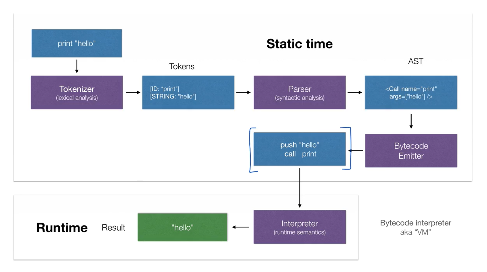
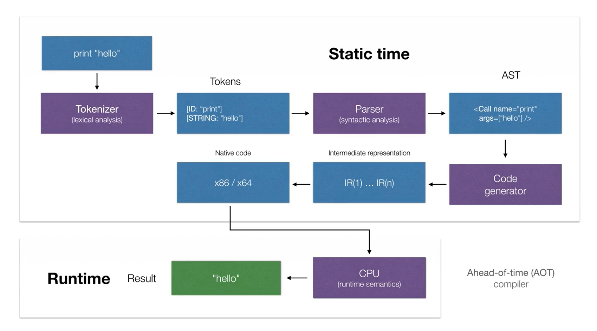
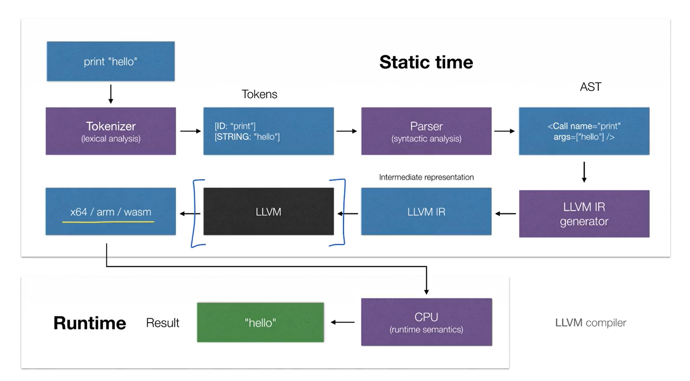
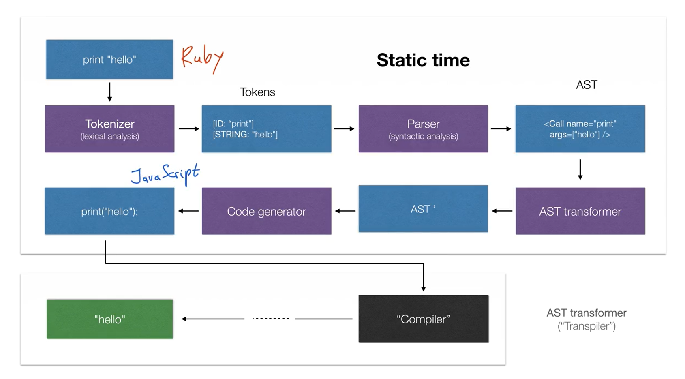

# Part 1: Compilers crash sourse

## Lecture 1
这门课的主题：runtime semantics

与 runtime 相对应的是 static time，这 static time（static semantic）包含 tokenizer 与 parser 两部分，tokenizer 用来生成 token 对，parser 用来检查 token 对是否合法，生成 AST

Compiler和Interpreter的区别：only interpreters execute the code
 - Interpreter: implement semantics themselves. 解释器用于理解语义
   - 解释器有两种：
     - AST-based (recursive) 解释器：树形结构
     - Bytecode 解释器 (Virtual Machine, VM)
 - Compilers: Delegate semantics to a target language. It just translate the language from one to another. 编译器用于翻译，不用于理解
   - 解释器有三种：
     - Ahead-of-time (AOT) compilers (C++)
     - Just-in-time (JIT) compilers
     - AST-transformers (transpilers)
 - 总结：要像让一个语言P1能够output，必须要有解释器。如果没有P1的解释器，但我们有语言 P2 的解释器，那我们可以使用编译器将P1翻译成P2，然后使用P2的解释器得到output。最 low level 的解释器是 CPU 本身，所以如果你将一个语言翻译成machine instructions（x86 汇编），那么CPU将能执行它们。

## Lecture 2: Interpreters

### AST interpreter: how it produces the result
https://astexplorer.net/
AST interpreter operates at high level and provide high level semantics. 这就是说not operate at low level such as assembly instructions or memory




## Lecture 3: Compilers

### AOT compiler



### JIT compiler


### AST transformer



## Lecture 4
Specific implement of a programming language, whether it will be AST interpreter, Bytecode interpreter, or any type of compiler, doesn't really matter. What matters here is that **Runtime semantics should be preserved**. Regardless of the implementation, we should see the same result.

### Eva: A dynamic programming language with simple syntax, functional heart and OOP support
Eva language

### Expression format
```
// Eva:
(+ 5 10)           // addition
(set x 15)         // assignment
(if (> x 10)       // if
    (print "ok")
    (print "err"))
```
### Function declaration
define a function in scope

```python
// Python
def foo(bar):
    return bar + 10
```
```javascript
// JavaScript
function foo(bar) {
    return bar + 10;
}
```
```
// Eva
(def foo(bar)
    (+ bar 10))
```
all functions in Eva are closures

### Lambda expression
create an anonymous function

```python
//Python
(lambda x: x * x)(10)
```
```javascript
// JavaScript
(x => x * x)(10);
```
```
// Eva
(lambda (x) (* x x) 10)
```
IILE: Immediately-invoked lambda expression

### Design goals
 - Simple syntax: S-expression
 - Everything in an expression
   - Statement：while没有返回值
   - Expression：while有返回值，可以用while的结果给变量赋值
 - No explicit return, last evaluated expression is the result
 - First-class functions: assign to variables, pass as arguments, return as values
 - Static scope: all functions are closures
 - Lambda functions: IILEs
 - Functional programming
 - Imperative programming
 - Namespaces and modules
 - OOP: class-based, pro`-based

Q&A:
 - 什么是S-expression？
   - S-expression (简称 s-expr 或 sexp) 是一种编程语言的表达式，常被用于 Lisp 系语言和 Scheme 编程语言。它由一个括号包围的符号列表组成，其中第一个符号被视为函数，剩余的符号被视为函数的参数。例如，"(+ 2 3)" 是一个 S-expression，它表示调用 "+" 函数并传入参数 2 和 3。
 - 什么是First-class functions
```javascript
// JS: create closure
function createCounter() {
    let i = 0;
    return () => i++;
}

const count = createCounter();

count();
count();
```

```
// Eva: create closure
(def createCounter()
    (begin
    (var i 0)
    (lambda () (++ i))))

(var count (createCounter))

(count)
(count)
```

## Lecture 5: Self-evaluating expressions

BNF，一般用来定义parser，这里我们也用来定义runtime semantics

## Lecture 6

Variable declarition: defines a variable in scope

```javascript
// JavaScript
let foo = 10;
```
```python
// Python
foo = 10
```
```
// Eva
(var fooo 10)
```

Assignment expression: assigns a value to a variable

```python
// Python
foo = 10
```
```javascript
// JavaScript
foo = 10;
```
```
// Eva
(set foo 10)
```

Variable access: lookup a variable value

```python
//Python
foo
square(2)
```

```javascript
// JavaScript
foo;
square(2);
```

```
// Eva
foo
(square 2)
```


Environment interface:
 - Define a variable - (var x 10)
 - Assign a new value to a variable - (set x 20)
 - Lookup a variable - x


Block scope: new environment on block enter

```javascript
// JavaScript
let x = 10;
console.log(x);     // 10

{
  let x = 20;
  console.log(x);   // 20
}

console.log(x);     // 10
```

```C++
// C++
int x = 10;
cout << x;          // 10

{
  int x = 20;
  cout << x;        // 20
}

cout << x;          // 10
```

```
// Eva
(var x 10)
(print x)           // 10

(begin
  (var x 20)
  (print x)         // 20
)

(print x)           // 10
```

Implementation: Class

a named environment which can be instantiated and create objects

